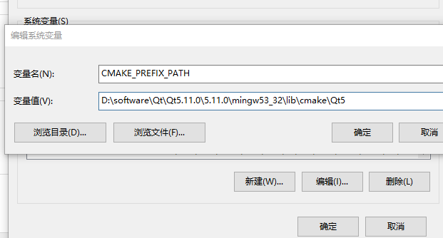

How to install and use.

## Preinstall
### Linux(Ubuntu)
$ sudo apt-get install cmake qt5-default libqt5qml5 qtdeclarative5-dev
maybe some of them are unnecessary

### Windows

download cmake here:
https://cmake.org/download/
download msi file and install

download qt here:
https://www.qt.io/download
download and install
remember to set the CMAKE_PREFIX_PATH environment variable to the install prefix of Qt 5.

you can also use qt creator or other ide(such as VisualStudio).
you will also need to add bin path of qt into enviroment variable and set some other things.
so.....you'd better use LINUX!

## Install&Buid
open terminal, cd to /path/to/repository

enter command below
$ mkdir build
$ cd build
$ cmake ..
$ make

At last run "traffic" in build folder

## Uncompleted simple demo
