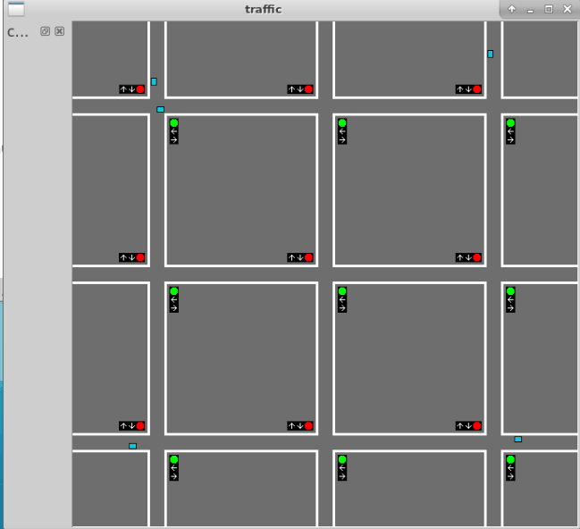

How to install and use.

## Preinstall
### Linux
$ sudo apt-get install cmake qt5-default libqt5qml5 qtdeclarative5-dev
maybe some of them are unnecessary

### Windows

download cmake here:
https://cmake.org/download/
download msi file and install

download qt here:
https://www.qt.io/download
download and install

use cmake-gui to build or use command(see "Install&Build")

## Install&Buid
open terminal(cmd in Windows), cd to /path/to/repository

enter command below
$ mkdir build
$ cd build
$ cmake ..
$ make

At last run "traffic" in build folder

## Uncompleted simple demo
